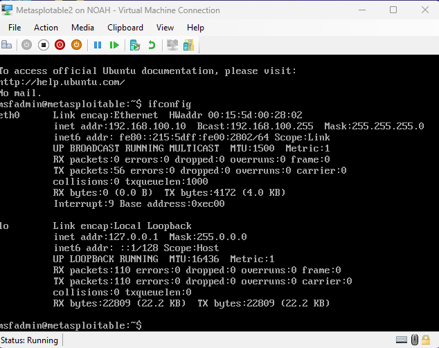
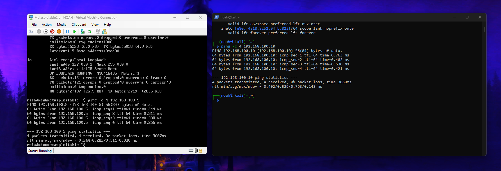

# Network Connection Setup and Verification

---

## Checking Network Configuration on Kali Linux

First, verify the network interfaces and IP addresses on Kali using:

```bash
ifconfig
```

This shows all active interfaces, their IPs, and statuses.



---

## Verifying Connectivity Between Kali and Metasploitable

To confirm that Kali can reach the Metasploitable VM, ping its IP address:

```bash
ping 192.168.100.10
```

Successful replies indicate network connectivity and proper routing.



---

## Next Steps

Once connectivity is confirmed, proceed with scanning the target or launching exploits.

```
