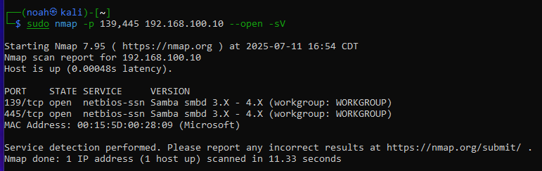
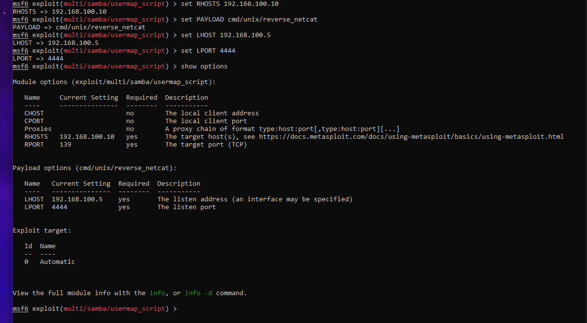
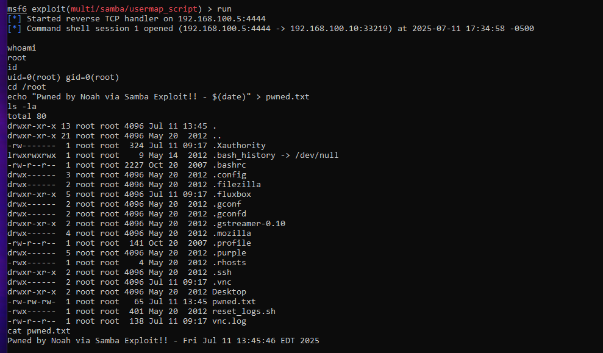

# Samba Exploit - Metasploitable2

This document outlines the exploitation process of a vulnerable Samba service (version 3.0.20-Debian) running on a Metasploitable2 virtual machine.

---

## Step 1: Scan for SMB Ports

**Objective:** Identify open SMB-related ports on the target system.

Run the following Nmap scan to check for ports 139 and 445 (used by Samba):

```bash
sudo nmap -p 139,445 192.168.100.10 --open -sV
```

**Scan Output:**



The scan shows both ports open and Samba smbd version 3.X - 4.X running under the WORKGROUP domain.

---

## Step 2: Search for Samba Exploits in Metasploit

**Objective:** Use Metasploit to find known vulnerabilities related to Samba.

Start Metasploit and search:

```bash
msfconsole
search samba
```

**Search Result:**


We identified `exploit/multi/samba/usermap_script` (related to CVE-2017-7494) as a usable exploit.

---

## Step 3: Run the Exploit

**Objective:** Gain a remote shell by configuring the exploit and launching it.

Select the exploit and configure the RHOST and LHOST accordingly:



**Execution Result:**


This confirms a reverse shell session was successfully opened, providing root-level access.

---

## Step 4: Post-Exploitation - Proof of Root Access

**Objective:** Create a file in `/root` to demonstrate full system compromise.

Commands used:

```bash
cd /root
echo "Pwned by Noah via Samba Exploit! - $(date)" > pwned.txt
ls -la
cat pwned.txt
```

**Proof Screenshot:**



This confirms successful post-exploitation and root-level file system access.

---

## Summary

This exploit demonstrates how a vulnerable Samba instance can be leveraged to gain full root access. It highlights the risks of running outdated services and the importance of proper access controls and patch management in networked environments.